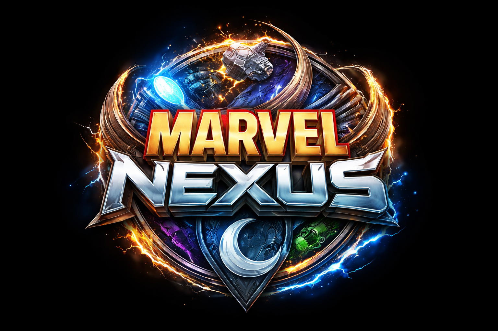

<!-- PROJECT HEADER -->

<p align="center">
  <table>
    <tr>
      <td align="left" width="260">
        
      </td>
      <td align="left">
        <h1>⚡ Marvel Nexus – Cyberpunk Hero Experience</h1>
        <em>🚀 A futuristic interactive Marvel UI with animated cards, glowing effects & immersive background music system 🎧</em>
      </td>
    </tr>
  </table>
</p>

---

<p align="center">
  <a href="https://marvel-nexus-inky.vercel.app/">
    
  </a>
  
  
  
  
</p>

---

## ✨ Overview

**Marvel Nexus** is a **cyberpunk-inspired interactive frontend experience** where Marvel heroes come alive through:

* 🎴 Dynamic animated cards
* 🎨 Real-time color theme sync
* 💫 Smooth hover & mobile interactions
* 🎧 Character-based background music

> 💡 Designed to showcase advanced frontend skills with animation, UX & audio integration.

---

## 🚀 Live Demo

🎯 **Try the experience here:**
👉 https://marvel-nexus-inky.vercel.app/

---

## 🧠 Project Philosophy

This project focuses on:

* ⚡ Immersive UI/UX
* 🎯 Center-focused interaction design
* 🎧 Audio + Visual synchronization
* 📱 Cross-device experience (Desktop + Mobile)

---

## 🧩 Tech Stack

| Layer          | Technologies                                                                                                                     | Purpose                    |
| :------------- | :------------------------------------------------------------------------------------------------------------------------------- | :------------------------- |
| **Frontend**   |    | Structure, styling & logic |
| **Library**    |                                                                     | Card slider system         |
| **Audio**      |                                                                      | BGM per character          |
| **Design**     |                                                                           | Visual styling             |
| **Deployment** |                                                                                  | Hosting                    |

---

## 🖼️ Preview

<p align="center">
  
</p>

---

## 💼 Core Features

| 🧩 Feature                  | 🌟 Description                      |
| :-------------------------- | :---------------------------------- |
| 🎴 **Interactive Cards**    | Smooth Swiper.js based hero slider  |
| 🎨 **Dynamic Theme**        | Each hero changes UI colors & glow  |
| 💫 **Animations**           | Hover & transition based UI effects |
| 🎧 **Hero Music System**    | Unique BGM for each character       |
| 🔁 **Smart Audio Control**  | Play / Pause / Resume system        |
| 📱 **Mobile Friendly**      | Tap-based interaction support       |
| ⚡ **Performance Optimized** | Lightweight & smooth rendering      |

---

## 🎧 Audio System

* 🎵 Each hero has a unique theme
* 🖱️ Desktop → Hover to play
* 📱 Mobile → Tap to toggle
* ⏯️ Resume from last timestamp
* 🚫 Auto-play restrictions handled

---

## 🧱 Architecture Overview

### 🎨 Frontend (HTML + CSS + JS)

* Dynamic DOM rendering
* Swiper.js integration
* Custom animation system
* Audio handling logic

---

## 📂 Project Structure

```bash
Marvel-Nexus/
│
├── assets/
│   └── audio/
│
├── css/
│   └── style.css
│
├── js/
│   └── app.js
│
├── images/
│
└── index.html
```

---

## 🌟 Future Improvements

* 🔊 Audio control UI button
* 🎬 Marvel-style intro animation
* 🌐 Custom domain integration
* ⚡ Performance enhancements

---

## 📜 License

This project is licensed under the MIT License.

---

## 💖 Acknowledgements

> "Built with passion to create an immersive Marvel-inspired cyberpunk experience."

---

## 🧡 Footer

<p align="center">
  <b>✨ Created with ❤️ by <a href="https://github.com/hey-itz-sameerkhan">Sameer Khan</a> ✨</b><br><br>
  <br>
  <sub>© 2026 Marvel Nexus</sub>
</p>
